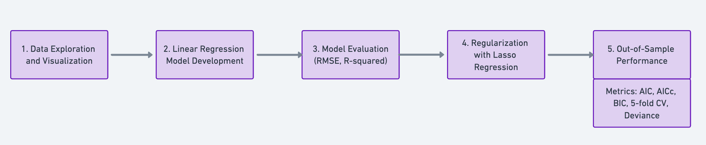

# Lasso Regression (Melbourne House Price Prediction)

## Overview
This project aims to develop predictive models for estimating the price of houses in Melbourne using various features such as the number of bedrooms, bathrooms, parking spots, and square footage area. Through comprehensive data analysis and application of machine learning models, including Linear and Lasso Regression, the project seeks to understand the factors influencing house prices and predict them accurately.

## Data Description
The dataset consists of 500 observations and 21 columns, detailing various aspects of houses in Melbourne that could potentially affect their market price. The target variable is the house price, while the predictor variables include the number of bedrooms, parking spots, square footage area, and others. Notably, the dataset features a mix of numerical and categorical data, requiring careful preprocessing to prepare for model training.

## Project Structure

1. Data Exploration and Visualization
- Objective: To understand the dataset's distribution and characteristics through visual analysis.
- Methods: Utilization of histograms, scatter plots, and box plots to visualize the distribution of features and their relationship with the target variable.

2. Linear Regression Model Development
- To develop a model capable of predicting Melbourne house prices.
- Preprocessing Steps:
Handling missing values and encoding categorical variables.
Removal of columns with substantial missing data or those deemed irrelevant to the target variable.
Application of log transformation to normalize the distribution of the target variable.

3. Model Evaluation
- Objective: To assess the performance of the Linear Regression model.
- Metrics Used: RMSE (Root Mean Squared Error) and R-squared.

4. Regularization with Lasso Regression
- Objective: To address potential overfitting and improve model generalization.
A- pproach: Implementation of Lasso Regression with parameter tuning.

5. Out-of-Sample Performance
- Objective: To compare the true out-of-sample performance of both Linear and Lasso Regression models.

- Estimation of AIC, AICc, BIC, and 5-fold Cross-Validation scores. Deviance computation on the test data for true out-of-sample performance assessment.

## Main Highlights and Outcomes

- Data Insights: Log transformation of the target variable and categorical features significantly impacted house price predictions. The removal of columns with excessive missing data or irrelevant information streamlined the dataset for more effective modeling.
- Model Performance: Initial overfitting in the Linear Regression model was mitigated through Lasso Regression, which offered a more generalized model capable of making more accurate predictions on unseen data.
- Regularization Impact: Lasso Regression improved model generalization but also suggested the possible exclusion of beneficial features, as indicated by the slight increase in RMSE for out-of-sample data.
- Out-of-Sample Evaluation: The close resemblance of Cross-Validation scores to out-of-sample R-squared values validated the models' predictive capabilities. Information Criterion metrics provided further insights into model complexity and performance, favoring simpler, more generalizable models.

## Conclusion
The Melbourne House Price Prediction Project illustrates the complexity of real estate pricing and the effectiveness of machine learning models in capturing and predicting these dynamics. Through careful data preprocessing, model selection, and regularization, the project highlights the balance between model complexity and predictive accuracy, providing valuable insights into Melbourne's real estate market.
